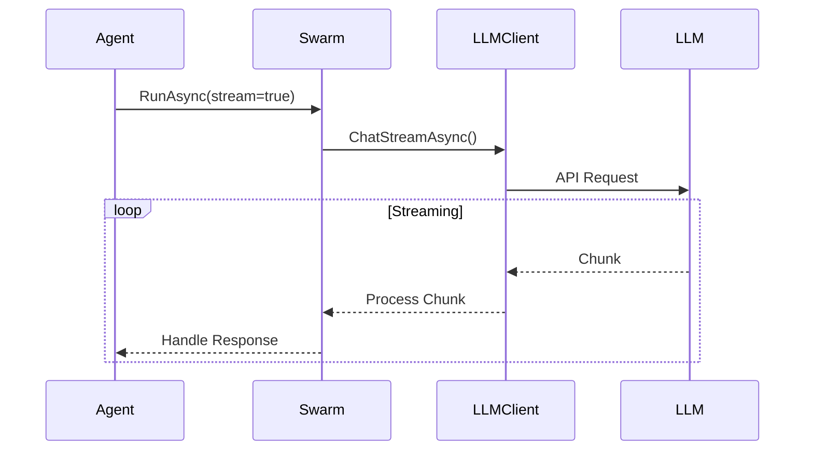

# Swarm C# Implementation Design Document

## Overview

This document outlines the C# implementation of the Swarm framework, based on the existing Java implementation. The framework enables building LLM-powered applications with multiple AI agents working together seamlessly.

## Core Components

### 1. Agent System
- Core abstract class: `Agent`
- Key responsibilities:
  - Execute requests with context
  - Provide system prompt
  - Define tool choice mode
  - Implement functions with attributes

### 2. Function Attribute System
- `[FunctionSpec]`: Defines function metadata
  - name: Function name for LLM
  - description: Function description
- `[Parameter]`: Defines parameter metadata
  - name: Parameter name
  - description: Parameter description
  - type: Parameter type (default: "string")
  - required: Whether parameter is required (default: true)

### 3. Result System
- Core class: `Result`
- Encapsulates function return values:
  - value: The actual return value
  - contextUpdates: Updates to context variables
- Supports:
  - Simple string returns
  - Complex object returns
  - Context variable updates

### 4. LLM Client System
- Base interface: `ILLMClient`
- Implementations:
  - OpenAIClient
  - AzureOpenAIClient
  - ChatGLMClient
  - OllamaClient
- Configuration:
  - API keys
  - Base URLs
  - Model selection
  - Provider-specific settings

### 5. Context Management
- Thread-safe context operations
- Variable persistence
- State management across turns
### 6. The orchestrator SwarmCore
- The core class that orchestrates the swarm
- The main entry point for the swarm
- The class that manages the main loop of the swarm, including the hand-off between agents and the LLM results handling

## Project Structure

```
src/Swarm.CSharp/
├── Core/
│   ├── Agent.cs              # Base abstract class for agents
│   ├── Instructions.cs       # Instructions interface
│   ├── SwarmCore.cs             # Main orchestrator
│   ├── SwarmContext.cs      # Context management
│   ├── SwarmResponse.cs     # Response model
│   └── ToolChoice.cs        # Tool choice enum
│
├── Functions/
│   ├── Attributes/
│   │   ├── FunctionSpecAttribute.cs    # Function metadata
│   │   └── ParameterAttribute.cs       # Parameter metadata
│
├── LLM/
│   ├── ILLMClient.cs        # LLM client interface
│   ├── Models/
│   │   ├── ChatRequest.cs   # Request model
│   │   ├── ChatResponse.cs  # Response model
│   │   ├── Message.cs       # Message model
│   │   └── FunctionSchema.cs # Function schema
│   │
│   └── Providers/
│       ├── OpenAIClient.cs  # OpenAI implementation
│       ├── AzureOpenAIClient.cs # Azure implementation
│       ├── ChatGLMClient.cs # ChatGLM implementation
│       └── OllamaClient.cs  # Ollama implementation
```

## Implementation Details

### 1. Agent Implementation
```csharp
public abstract class Agent
{
    public virtual string GetSystemPrompt(IDictionary<string, object> context)
    {
        // Default system prompt implementation
    }

    public virtual ToolChoice GetToolChoice()
    {
        return ToolChoice.Auto;
    }

    // Function discovery and tool management
    public virtual IList<IDictionary<string, object>> GetTools()
    {
        // Discover and return available tools
    }
}
```

### 2. Function Attributes
```csharp
[AttributeUsage(AttributeTargets.Method)]
public class FunctionSpecAttribute : Attribute
{
    public string Name { get; set; }
    public string Description { get; set; }
}

[AttributeUsage(AttributeTargets.Parameter)]
public class ParameterAttribute : Attribute
{
    public string Name { get; set; }
    public string Description { get; set; }
    public string Type { get; set; } = "string";
    public bool Required { get; set; } = true;
}
```

### 3. LLM Client Interface
```csharp
public interface ILLMClient
{
    Task<ChatResponse> ChatAsync(ChatRequest request);
    Task<Stream> ChatStreamAsync(ChatRequest request);
}
```

## Key Features

1. **Attribute-Based Discovery**
   - Automatic function registration
   - Schema generation
   - Type-safe parameter handling

2. **Flexible LLM Support**
   - Multiple provider support
   - Environment-based configuration
   - Model configuration in client

3. **Simple Agent Development**
   - Implement Agent abstract class
   - Add function attributes
   - Define system prompt

4. **Error Handling**
   - LLM API errors
   - Function execution errors
   - Parameter validation errors

## Streaming Support

The framework will provide real-time streaming capabilities:



## Error Handling Strategy

1. **Exception Types**
   - SwarmException: Base exception
   - LLMException: LLM-related errors
   - ValidationException: Input validation
   - ConfigurationException: Setup issues

2. **Retry Mechanism**
   ```mermaid
   graph TD
       A[Error Occurs] --> B{Retryable?}
       B -->|Yes| C[Exponential Backoff]
       C --> D[Retry Request]
       D --> E{Success?}
       E -->|No| B
       E -->|Yes| F[Continue]
       B -->|No| G[Throw Exception]
   ```

## Context Management

1. **Thread Safety**
   - Read-write locks
   - Atomic operations
   - Concurrent collections

2. **Context Lifecycle**
   ```mermaid
   stateDiagram-v2
       [*] --> Initialize
       Initialize --> Active
       Active --> Updated: Function Call
       Updated --> Active
       Active --> Saved: Save State
       Saved --> Active: Restore
       Active --> [*]: End
   ```

## Configuration System

1. **Environment Variables**
   ```ini
   # OpenAI Configuration
    OPENAI_API_KEY=your_openai_api_key_here
    OPENAI_ORG_ID=your_openai_org_id_here
    OPENAI_MODEL=gpt-4
    OPENAI_API_BASE=https://api.openai.com

    #Azure OpenAI Configuration
    AZURE_OPENAI_API_KEY=your_azure_openai_api_key_here
    AZURE_OPENAI_ENDPOINT=your_azure_openai_endpoint_here
    AZURE_OPENAI_DEPLOYMENT_ID=your_deployment_id_here

    #ChatGLM Configuration
    ZHIPUAI_API_KEY=your_zhipuai_api_key_here
    ZHIPUAI_API_BASE=https://open.bigmodel.cn/api/paas/v4/
    ZHIPUAI_MODEL=glm-4-plus

    #Ollama Configuration
    OLLAMA_BASE_URL=http://localhost:11434
   ```

